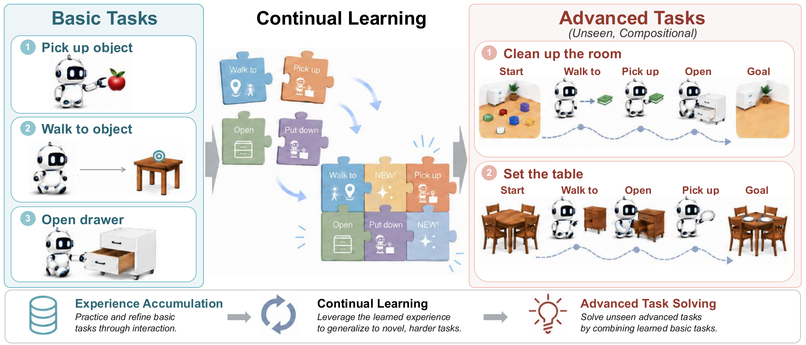
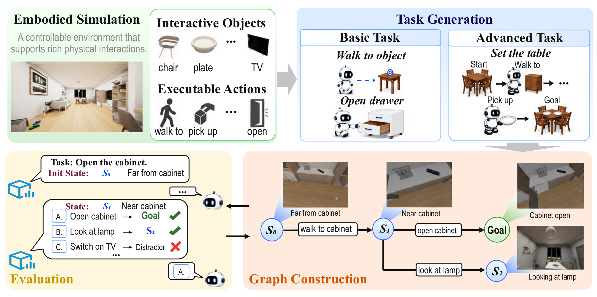
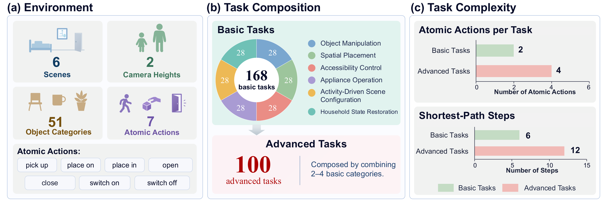
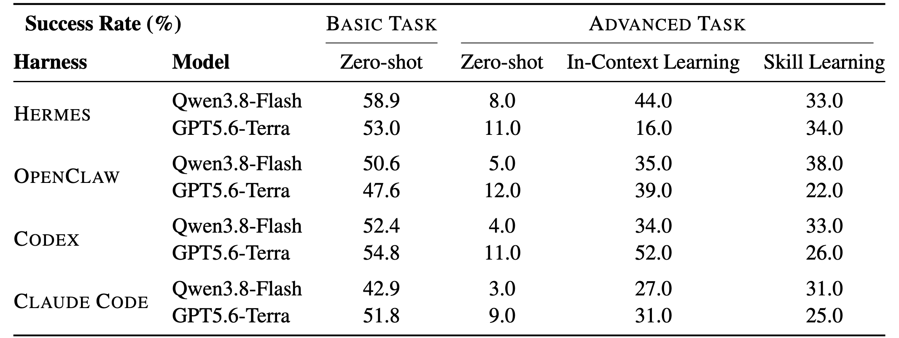

<h1 align="center">EmbodiedCLBench: Evaluating Continual Learning for Self-Evolving Embodied Agents</h1>

<p align="center"><em>The first benchmark in embodied simulation for evaluating<br>
the continual learning capability of self-evolving agents</em></p>

<p align="center">
  
  <a href="https://pku-value-lab.github.io/EmbodiedCLBench-homepage/"></a>
  <a href="https://huggingface.co/datasets/PKU-VaLuE-Lab/EmbodiedCLBench"></a>
  <a href="https://github.com/PKU-VaLuE-Lab/EmbodiedCLBench"></a>
</p>

<p align="center">
  <a href="https://jie-1203.github.io/">Jie Huang</a><sup>★,1,2</sup>&emsp;
  <a href="https://github.com/YananChen8">Yanan Chen</a><sup>★,1</sup>&emsp;
  <a href="https://liuruixun.github.io/">Ruixun Liu</a><sup>★,1</sup>&emsp;
  <a href="https://hkc20.github.io/">Kaichen He</a><sup>1</sup>
  <br>
  <a href="https://github.com/hexinyi2101">Xinyi He</a><sup>1</sup>&emsp;
  <a href="https://ruihuangai.github.io/">Rui Huang</a><sup>3</sup>&emsp;
  <a href="https://zilongzheng.github.io/">Zilong Zheng</a><sup>2</sup>&emsp;
  <a href="https://www.zlz.link/">Zhenliang Zhang</a><sup>2</sup>&emsp;
  <a href="https://yiwuzhong.notion.site/homepage">Yiwu Zhong</a><sup>1,2,†</sup>
</p>

<p align="center">
  <sup>1</sup>School of Intelligence Science and Technology, Peking University<br>
  <sup>2</sup>State Key Laboratory of General Artificial Intelligence, BIGAI, Beijing, China<br>
  <sup>3</sup>University of Hong Kong
</p>

<p align="center">★ Equal contribution.&emsp;† Corresponding author.</p>

## Core design

<p align="center">
  
</p>

We operationalize continual learning through compositional generalization: an agent first completes simpler tasks to accumulate experience, then is tested on whether it can recombine the acquired skills to solve more complex, unseen tasks.

## Abstract

Continual learning requires models to accumulate past experience and transfer it to new tasks. Despite substantial research on continual learning, existing work remains largely confined to non-embodied settings, without extending to embodied environments.

To address this gap, we introduce EmbodiedCLBench, the first benchmark in embodied simulation for evaluating the continual learning capability of self-evolving agents. With compositional generalization as the core evaluation principle, our benchmark evaluates whether agents can first learn from basic tasks and then recombine the acquired skills to solve complex, unseen advanced tasks. Based on EmbodiedCLBench, we conduct extensive experiments across multiple agent harnesses and learning methods, revealing consistent limitations and distinctive behaviors.

Our results show that while advanced tasks can be hardly solved under zero-shot setting, the experience from basic tasks enables consistent improvement. Such benefit from the experience remains stable even if the task complexity increases. However, this improvement does not scale accordingly with the number of learning samples, and current agents cannot extract meaningful information from additional experience. Collectively, our findings highlight continual learning as a fundamental yet underexplored capability, and our benchmark offers valuable resources for designing effective self-evolving agents in embodied environments.

## Benchmark Construction

<p align="center">
  <br>
  Overview of the construction process
</p>

<br>

<p align="center">
  <br>
  Benchmark statistics
</p>

## Main Results

<p align="center">
  
</p>

(1) **Zero shot:** the agent attempts tasks directly without prior experience. (2) **In-Context Learning (ICL):** the agent first completes two related basic tasks, retaining the full interaction history in context for the advanced task. (3) **Skill Learning:** the same learning phase as ICL, but the agent distills its experience into a concise skill summary, which replaces the raw trajectories at test time.

## Usage

Following the steps below takes you from a clean machine through environment setup, data download, runtime installation, Smoke, the 20% pilot, and the full experiment.

The current default is the Qwen3.8-Flash API. The evaluation does not load a local model and does not require a GPU.

### 1. Download the Code

```bash
git clone https://github.com/PKU-VaLuE-Lab/EmbodiedCLBench.git
cd EmbodiedCLBench
```

Run the remaining commands from the `EmbodiedCLBench` repository root.

### 2. Prepare the Python Environment

You need Linux x86_64, Python 3.10 or newer, Bash, and Git.

If Conda is not installed, install Miniconda in your user directory without administrator access:

```bash
curl -L -o "$HOME/miniconda.sh" \
  https://repo.anaconda.com/miniconda/Miniconda3-latest-Linux-x86_64.sh
bash "$HOME/miniconda.sh" -b -p "$HOME/miniconda3"
source "$HOME/miniconda3/etc/profile.d/conda.sh"
```

If Conda is already installed, source the existing `conda.sh`, for example:

```bash
source "$HOME/miniconda3/etc/profile.d/conda.sh"
```

Create and activate the environment:

```bash
conda create -n tongbench -c conda-forge --override-channels \
  python=3.10 pip -y
conda activate tongbench
```

Install the project dependencies:

```bash
python -m pip install -U pip setuptools wheel
python -m pip install -r public/eval/requirements.txt
python -m pip install -r public/eval/requirements-api-vlm.txt
python -m pip install -r public/eval/requirements-visualization.txt
python -m pip install -U huggingface_hub matplotlib
python -m pip install -e public/eval
```

Verify that the Python entry points start:

```bash
PYTHONPATH="$PWD/public/eval/src" \
  python -m tongbench_eval.cli.framework.ready_single_tasks --help
PYTHONPATH="$PWD/public/eval/src" \
  python -m tongbench_eval.cli.framework.dialogue --help
```

Keep `conda activate tongbench` active when running `For_user/scripts/*.sh`. These scripts use the
active environment and require Python 3.10 or newer. If you do not use Conda, set
`PYTHON_BIN=/path/to/env/bin/python` explicitly.

### 3. Download the Runtime Components

The four runtime harnesses are packaged in a Hugging Face dataset:

```text
https://huggingface.co/datasets/PKU-VaLuE-Lab/EmbodiedCLBench-Native-Harnesses
```

Run the download and installation script:

```bash
bash For_user/scripts/download_native_harnesses_from_huggingface.sh
source "$HOME/.local/share/tongbench/harnesses/env.sh"
```

The script downloads the archive, verifies its SHA256 checksum, and installs it under:

```text
$HOME/.local/share/tongbench/harnesses
```

The installer stages the files beside the destination, checks the checksum and runtime dependencies,
and publishes the final directory only after all checks pass. If an earlier installation was
interrupted, remove the empty temporary directory under the user installation path and rerun it.

### 4. Download the Input Data

The input dataset is hosted in a Hugging Face dataset:

```text
https://huggingface.co/datasets/PKU-VaLuE-Lab/EmbodiedCLBench
```

Run:

```bash
bash For_user/scripts/download_input_from_huggingface.sh
```

After the download, these directories should exist:

```text
For_user/data/input/merged/
For_user/data/subsets/stage0_smoke/
For_user/data/subsets/stage2_20pct/
For_user/data/subsets/stage3_full/
```

The archive does not need a second copy of the Smoke subset. If
`For_user/data/subsets/stage0_smoke/` is absent, the Smoke script reuses the Stage 2 input and
selects one L4 task together with its learning L2 task.

### 5. Configure the Qwen API

Copy the API configuration template outside the repository and fill in the real key:

```bash
cp For_user/configs/api_models.example.env "$HOME/tongbench_api.env"
vi "$HOME/tongbench_api.env"
source "$HOME/tongbench_api.env"
```

At minimum, configure:

```bash
export QWEN_MODEL="qwen3.8-flash"
export QWEN_BASE_URL="https://dashscope.aliyuncs.com/compatible-mode/v1"
export QWEN_CLAUDECODE_BASE_URL="https://dashscope.aliyuncs.com/apps/anthropic"
export QWEN_API_KEY="<your_qwen_api_key>"
```

If your API gateway uses different endpoints, change only `QWEN_BASE_URL`,
`QWEN_CLAUDECODE_BASE_URL`, and `QWEN_API_KEY`.

Never commit a real API key to Git.

### 6. Run the Environment Check

After configuring Python, the runtime components, the data, and the API, check the environment:

```bash
bash For_user/scripts/check_environment.sh
```

This check does not call a model. It checks Python dependencies, the main CLIs, and input directories.

In native mode it also checks the bundled Python, the `mcp` version, all four harness entry points,
the Claude Code entry point, and the runtime checksum. If an environment variable is missing,
source the `.../env.sh` file again.

The scripts use the task templates bundled in the repository. If the template location changes,
override it with `ATOMIC_TEMPLATE_PATH` and `SUBTASK_TEMPLATE_PATH`.

### 7. Stage 0 Smoke

Smoke runs one sample for each combination to verify that all four harnesses and all four settings
complete successfully:

```text
Model: Qwen3.8-Flash
Harnesses: HermesAgent, Codex, Claude Code, OpenClaw
Settings: Basic L2, Zero-shot L4, In-context L4, Skill L4
```

Run:

```bash
source "$HOME/.local/share/tongbench/harnesses/env.sh"
source "$HOME/tongbench_api.env"
bash For_user/scripts/run_stage0_smoke.sh
```

To check command expansion without calling the API:

```bash
DRY_RUN=1 bash For_user/scripts/run_stage0_smoke.sh
```

Output directory:

```text
For_user/output/stage0_smoke/<model>/<harness>/<setting>/
```

The script also writes:

```text
For_user/output/stage0_smoke/stage0_validation.json
For_user/output/stage0_smoke/stage0_validation.md
```

These files verify that the runtime actually completed (subprocess return code, score, logs, and
trajectory), rather than treating a model-selection mistake as a successful Smoke run.

Smoke runs multiple combinations in parallel by default. Change the number of concurrent combinations:

```bash
SMOKE_PARALLEL_JOBS=8 bash For_user/scripts/run_stage0_smoke.sh
```

### 8. Stage 2: 20% Pilot

Stage 2 uses a 20% subset balanced by scene, camera height, and task type to inspect preliminary
results and trajectories:

```bash
bash For_user/scripts/run_stage2_20pct.sh
```

The default run contains `1 x 4 x 4 = 16` combinations:

```text
Model: Qwen3.8-Flash
Harnesses: 4
Settings: Basic L2, Zero-shot L4, In-context L4, Skill L4
```

Output directory:

```text
For_user/output/stage2_20pct/<model>/<harness>/<setting>/
```

Select a specific model, harness, or setting:

```bash
MODELS=qwen \
HARNESSES=hermesagent \
SETTINGS=basic_l2 \
bash For_user/scripts/run_stage2_20pct.sh
```

Multiple values can be provided as a space- or comma-separated list:

```bash
HARNESSES="hermesagent codex" \
SETTINGS="basic_l2 zero_shot_l4" \
bash For_user/scripts/run_stage2_20pct.sh
```

Concurrency parameters:

```bash
COMBO_PARALLEL_JOBS=4 \
PARALLEL_JOBS=6 \
SELF_EVOLUTION_PARALLEL_JOBS=3 \
bash For_user/scripts/run_stage2_20pct.sh
```

Meaning:

- `COMBO_PARALLEL_JOBS`: number of model/harness/setting combinations running concurrently.
- `PARALLEL_JOBS`: number of concurrent tasks inside Basic L2 and Zero-shot L4.
- `SELF_EVOLUTION_PARALLEL_JOBS`: number of concurrent tasks inside In-context L4 and Skill L4.

The scripts support resuming; successfully completed tasks are not run again.

### 9. Summarize Results

After any stage finishes, run:

```bash
bash For_user/scripts/summarize_results.sh
```

To summarize only one stage:

```bash
STAGES=stage2_20pct bash For_user/scripts/summarize_results.sh
```

If the results are in a non-default directory:

```bash
OUTPUT_ROOT=/path/to/output \
REPORT_ROOT=/path/to/reports \
bash For_user/scripts/summarize_results.sh
```

Reports are written to:

```text
For_user/output/reports/
```

The report directory contains:

```text
task_rows.csv       # per-task success at the three-extra-step budget
main_table.csv      # three-extra-step SR aggregated by model/harness/setting
sr_*.svg            # three-extra-step success-rate plots
```

The evaluation settings remain unchanged. The summary recomputes success rate from the saved raw
trajectories using a budget of three extra steps beyond the shortest path.

### 10. Stage 3: Full Experiment

After Smoke and Stage 2 show no obvious problems, run the full experiment:

```bash
bash For_user/scripts/run_stage3_full.sh
```

Full results are written to:

```text
For_user/output/stage3_full/<model>/<harness>/<setting>/
```

You can select specific combinations:

```bash
MODELS=qwen \
HARNESSES="hermesagent codex" \
SETTINGS="basic_l2 zero_shot_l4" \
bash For_user/scripts/run_stage3_full.sh
```

The full stage saves raw outputs, learning trajectories, skill summaries, and human traces. After
completion, upload the results to the appropriate private Hugging Face dataset if you need to
archive them.

### 11. Troubleshooting

#### API rate limits or quota errors

Wait a few minutes and rerun the same stage script. The scripts resume and do not call already
successful tasks again.

#### A Python entry point does not start

Confirm that you ran:

```bash
conda activate tongbench
source "$HOME/.local/share/tongbench/harnesses/env.sh"
```

Then rerun:

```bash
bash For_user/scripts/check_environment.sh
```

#### Rerun one combination

For example, run only the Codex Smoke:

```bash
HARNESSES=codex bash For_user/scripts/run_stage0_smoke.sh
```

#### Lower or increase concurrency

For Smoke, adjust `SMOKE_PARALLEL_JOBS`. For Stage 2 and Stage 3, adjust
`COMBO_PARALLEL_JOBS`, `PARALLEL_JOBS`, and `SELF_EVOLUTION_PARALLEL_JOBS`.

## Citation
